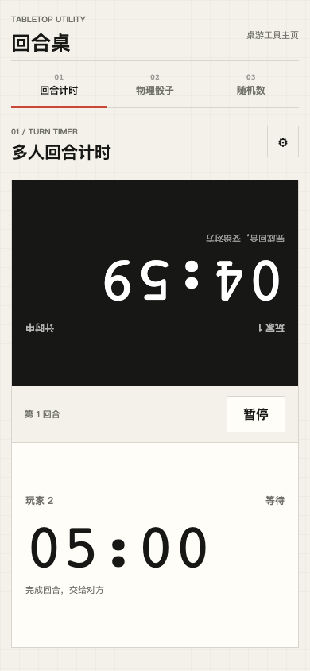
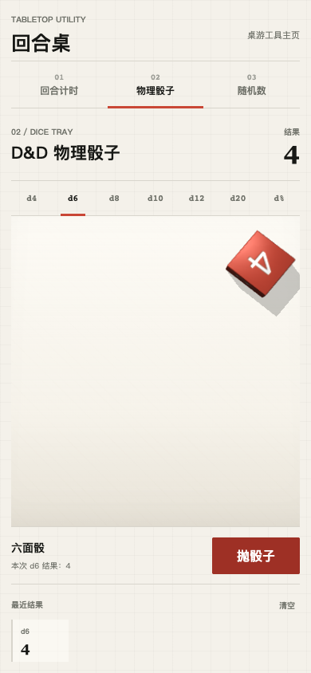
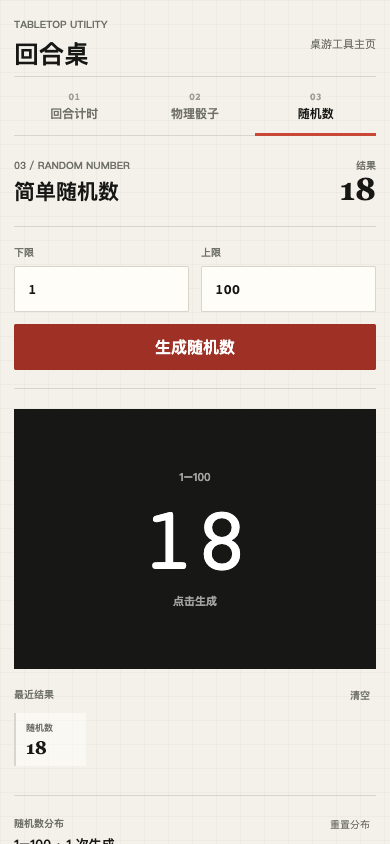

# TurnTable · 回合桌

**A mobile-first board-game turn timer, 3D dice tray, and random-number toolkit — in one zero-install web app.**

**一款为桌游、D&D 与多人对局设计的移动端工具：回合计时、物理骰子与随机数，打开网页即可使用。**

**Project status:** active

[**Open the live app →**](https://board-game-turn-timer.pages.dev/)

<table>
  <tr>
    <td width="33%"></td>
    <td width="33%"></td>
    <td width="33%"></td>
  </tr>
  <tr>
    <td align="center"><strong>Turn timer</strong><br>回合计时</td>
    <td align="center"><strong>3D dice</strong><br>物理骰子</td>
    <td align="center"><strong>Random numbers</strong><br>随机数</td>
  </tr>
</table>

## Why TurnTable?

- **One page, three tools.** Move between a multiplayer clock, a physics dice tray, and a configurable random-number generator without losing each tool's session state.
- **Built for the table.** The two-player clock faces opposite seats; multiplayer mode rotates through 2–8 players and skips expired timers automatically.
- **Every standard RPG die.** Roll d4, d6, d8, d10, d12, d20, or percentile dice and inspect per-die history and distributions.
- **Graceful offline fallback.** If the optional 3D engine cannot load, dice rolls fall back to the browser's cryptographically secure random generator.
- **No account, install, or backend.** It is a static vanilla JavaScript app that runs entirely in the browser.

## Features

| Tool | Capabilities |
|---|---|
| Turn timer | 2–8 players, custom names and time banks, pause/resume, direct player selection, automatic timeout skipping |
| Physical dice | 3D rigid-body rolls, d4–d20 and d%, recent results, per-die distribution histograms |
| Random numbers | Custom integer range, result history, adaptive distribution buckets |

## Quick start

Use the [hosted app](https://board-game-turn-timer.pages.dev/) or run it locally:

```bash
git clone https://github.com/jas0nh/board-game-turn-timer.git
cd board-game-turn-timer
python3 -m http.server 8000
```

Then open `http://localhost:8000`.

## Deploy

This repository is ready for Cloudflare Pages with no build step:

- Framework preset: `None`
- Build command: empty
- Build output directory: `/`

Local Pages preview:

```bash
pnpm dlx wrangler pages dev .
```

## Stack

Vanilla HTML, CSS, and JavaScript. The optional 3D dice renderer is loaded at runtime; all core tools retain a local fallback.

## License

[MIT](LICENSE)
